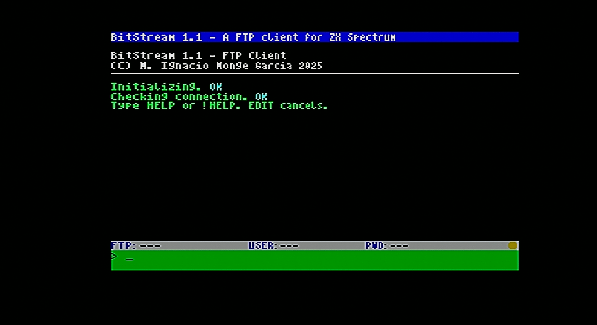

# BitStream
## FTP Client for ZX Spectrum

[🇪🇸 Versión en Español](READMEsp.md)

Full-featured FTP client with ESP8266/ESP-12 WiFi connectivity and 64-column interface.

---

## Features

### Connectivity
- **WiFi ESP8266/ESP-12** via AY-UART bit-banging at 9600 baud
- **512-byte ring buffer** for efficient data handling
- **Automatic connection monitoring** in real-time
- **Disconnect detection** (timeout, remote close)

### FTP Protocol
- **OPEN** - Connect to FTP server
- **USER** - Login with username/password
- **PWD** - Show current directory (with automatic retry)
- **LS** / **LIST** - List files and directories
- **CD** - Change directory
- **GET** - Download files (batch support and quotes)
- **PUT** - Upload files to server
- **QUIT** - Close connection

### User Interface
- **64 columns** with custom 4x8 pixel font
- **Optimized rendering** with fast-path for full lines
- **Command history** (↑/↓ to navigate)
- **Visual indicators** for WiFi/FTP status
- **Permanent status bar**
- **Cancellation** with EDIT key

### File Transfers
- **Multiple downloads**: `GET file1.txt file2.zip file3.rar`
- **Filenames with spaces**: `GET "User Manual.pdf"`
- **Progress bar** in real-time
- **Statistics**: speed, time, bytes transferred
- **Automatic retries** on error

---



## Hardware Requirements

1. **ZX Spectrum 48K/128K**
2. **AY-3-8912 interface**
3. **ESP8266 or ESP-12 WiFi module**
   - Connected to AY pins (UART bit-banging)
   - Configured at 9600 baud

---

## Quick Commands

### Quick Connect
```
!CONNECT ftp.server.com/path username password
```
Connects, logs in, and changes directory in a single command.

### Special Commands
```
!HELP      Help on special commands
HELP       Help on standard FTP commands
STATUS     WiFi/FTP connection status
ABOUT      Program information
CLS        Clear screen
```

### Usage Examples
```
OPEN ftp.gnu.org
USER anonymous zx@spectrum.net
CD /gnu/gcc
LS
GET "gcc manual.pdf"
QUIT
```

---

## What's New in v1.1

### ✨ Performance Improvements
- Ring buffer expanded (256→512 bytes)
- 3-4x faster rendering on full lines
- More responsive keyboard (40ms vs 120ms previously)

### 🎯 New Features
- Quote support in filenames
- Already-logged-in detection (USER)
- PWD with automatic retry (8s timeout)

### 🐛 Bug Fixes
- Improved connection alive detection
- Robust argument parsing
- ~135 bytes of code optimized

---

## Compilation

### Requirements
- **Z88DK** (zcc)
- **Make** (optional, batch script available)

### Build
```bash
make
```

Or using batch script:
```batch
build.bat
```

Generates **BitStream.tap** (~40KB)

---

## ESP8266 Configuration

The ESP module must be configured with:
- **Baud rate**: 9600
- **Multi-connection mode**: Enabled (AT+CIPMUX=1)
- **Connected to WiFi network**

BitStream includes smart automatic initialization.

---

## Technical Notes

### Memory
- **Code**: ~40KB compiled
- **Ring buffer**: 512 bytes
- **FTP buffers**: ~2KB (commands, responses, data)
- **Compatible**: 48K and 128K (code in main memory)

### Architecture
- **UART bit-banging** via AY-3-8912 registers
- **64-column rendering** optimized with fast-path
- **Circular ring buffer** for UART reception
- **Write buffering** for fast transfers

### Limitations
- Passive FTP mode only (PASV)
- 8.3 filenames for local files (esxDOS)
- No SSL/TLS support (plain FTP)

---

## Credits

**Author**: M. Ignacio Monge García  
**Year**: 2025  
**License**: [To specify]

Based on:
- **espATZX** (WiFi UART)
- **Z88DK** (compiler)
- **esxDOS** (filesystem)

---

## Support

For bugs, suggestions or contributions:
[Include contact/repository]

---

[🇪🇸 Leer en Español](READMEsp.md)
