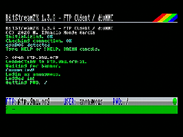
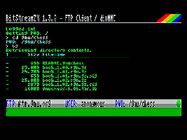
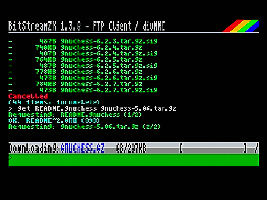
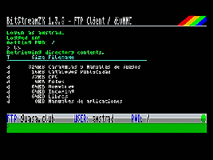
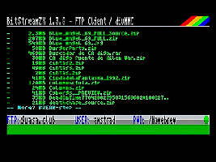
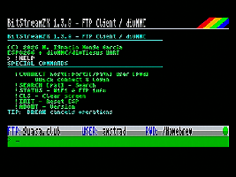

**FTP Client for ZX Spectrum**

BitStream is a WiFi FTP client for the ZX Spectrum using an ESP8266/ESP-12 module. It supports two UART backends: **divMMC/divTiesus** at 115200 baud and **AY-3-8912 bit-banging** at 9600 baud. Version 1.3.0 focuses on a safer transfer pipeline, tighter rendering, and a cleaner release build system.


> [Leer en Espanol](READMEsp.md)

## Features

- **Dual UART support** - divMMC/divTiesus (115200 baud) or AY bit-banging (9600 baud)
- **64-column UI** - compressed 4x8 font with color-coded output
- **Double-height status and progress bars** - cleaner status visibility with reduced flicker
- **Standard FTP commands** - `OPEN`, `USER`, `PWD`, `CD`, `LS`, `GET`, `QUIT`
- **Quick connect** - `!CONNECT host[:port][/path] user [pass]`
- **Interactive login** - masked password entry with `UP` to toggle visibility
- **Listing filters** - `LS -d` for directories, `LS -f` for files
- **Search filters** - `!SEARCH [pattern] [>size]`
- **Quoted filenames** - supports names with spaces in command arguments
- **Connection monitoring** - detects timeouts, disconnects, and broken control sessions
- **Safe downloads** - partial files are removed automatically after failed transfers
- **Command history and in-line editing** - `UP/DOWN/LEFT/RIGHT/BACKSPACE`
- **esxDOS integration** - direct SD card writes via RST 0x08 traps

[](images/BTS1.png) [](images/BTS2.png) [](images/BTS3.png)


## Requirements

### Hardware
- ZX Spectrum (48K/128K/+2/+3)
- divMMC or similar esxDOS-compatible interface
- ESP8266 or ESP-12 WiFi module connected via:
  - **divMMC/divTiesus UART** (directly on the interface, 115200 baud) - recommended
  - **AY-3-8912 chip** (bit-banging, 9600 baud)
- SD card with esxDOS

### Software
- esxDOS 0.8.x or higher
- WiFi network pre-configured on the ESP module (use [NetManZX](https://github.com/IgnacioMonge/NetManZX) or similar)

## Installation

Download the release assets for your target hardware:

- `BitStream_divTiesus.tap` for divMMC/divTiesus UART
- `BitStream_AY.tap` for AY bit-banging

Copy the `.tap` file to your SD card and load it with `LOAD ""`, or launch the generated binary directly from esxDOS if you prefer.

## Quick Start

```text
!CONNECT ftp.example.com/pub/spectrum anonymous
LS -f
GET "game.tap"
QUIT
```

Or connect step by step:

```text
OPEN ftp.scene.org
```

BitStream will prompt for username and password interactively. Press `ENTER` to accept the anonymous defaults. During masked password input, press `UP` to toggle visibility.

## Commands

### Standard FTP Commands

| Command | Description | Example |
|---------|-------------|---------|
| `OPEN host[:port]` | Connect to FTP server | `OPEN ftp.scene.org` |
| `USER name [pass]` | Login with credentials | `USER anonymous` |
| `PWD` | Show current directory | `PWD` |
| `CD path` | Change directory | `CD /pub/games` |
| `LS [filter]` | List directory contents (`-d` / `-f`) | `LS -f` |
| `GET file` | Download a file | `GET "Manual del Usuario.pdf"` |
| `QUIT` | Disconnect from server | `QUIT` |

### Special Commands

| Command | Description | Example |
|---------|-------------|---------|
| `!CONNECT` | Quick connect with optional path | `!CONNECT ftp.site.com/path user pass` |
| `!STATUS` | Show connection status | `!STATUS` |
| `!SEARCH [pattern] [>size]` | Search files | `!SEARCH *.tap >16000` |
| `!INIT` | Re-initialize the WiFi module | `!INIT` |
| `HELP` | Show standard commands | `HELP` |
| `!HELP` | Show special commands | `!HELP` |
| `!CLS` | Clear screen | `!CLS` |
| `!ABOUT` | Show version info | `!ABOUT` |

### Navigation

- **UP/DOWN** - command history
- **LEFT/RIGHT** - move cursor in the input line
- **BREAK** - cancel the current operation
- **ENTER** - execute command

## Search and Listing Filters

`LS` and `!SEARCH` both support extra filtering:

```text
LS -d                 # Directories only
LS -f                 # Files only
!SEARCH *.tap         # Name pattern
!SEARCH >16384        # Minimum size
!SEARCH *.sna >48000  # Pattern + minimum size
```

BitStream also preserves incoming UTF-8 bytes until the final ASCII conversion step, which improves listings for names containing accented or non-ASCII characters.

[](images/BTS4.png) [](images/BTS5.png) [](images/BTS6.png)


## Status Bar

The bottom status area shows:
- **Host** - connected server (or `---` if disconnected)
- **User** - logged-in username
- **Path** - current remote directory
- **Indicator** - connection state (green=logged in, yellow=connected, red=disconnected)

Version 1.3.0 uses double-height rendering for both the status bar and the transfer progress bar, with partial redraw logic to reduce flicker.

## Troubleshooting

### "No WiFi" on startup
- Ensure the ESP module is properly connected
- Check that WiFi is configured (use NetManZX first)
- Try `!INIT` to re-initialize the module

### Connection timeouts
- The server may have an idle timeout; reconnect with `!CONNECT`
- Check WiFi signal strength
- After a long paged listing pause, BitStream now probes the control channel before keeping the session alive

### Transfer errors
- Ensure sufficient free space on the SD card
- Failed or cancelled transfers now remove incomplete local files automatically
- Use `!STATUS` to verify that the control connection is still alive

### Commands not responding
- Press `BREAK` to cancel blocked operations
- Try `!INIT` to reset the ESP state

## Technical Details

- **UART**: divMMC/divTiesus at 115200 bps, or AY bit-banging at 9600 bps
- **Protocol**: FTP passive mode (`CIPMUX=1`, socket 0=control, 1=data)
- **Display**: 64-column text mode with compressed 4x8 font
- **Buffer**: 2048-byte ring buffer for UART traffic
- **Build pipeline**: BPE compression -> build -> restore -> BSS trim
- **Memory**: ORG 24000, 512-byte CRT stack, BSS trim via `__data_compiler_tail`
- **Timeouts**: frame-based (50Hz) for accurate timing

## Architecture

BitStream v1.3.0 keeps a modular Single Compilation Unit (SCU) layout:

```text
src/
  main_build.c         # SCU orchestrator (#includes all modules)
  globals.c            # Global state, constants, shared strings
  ui.c                 # Video, widgets, status bar, input zone
  comms.c              # Ring buffer, UART helpers, ESP init, TCP
  ftp.c                # FTP protocol, esxDOS, downloads, listings
  commands.c           # Command parser, help, status
  main.c               # Screen init, banner, main loop
  bitstream_copt.rul   # Extra size-oriented copt rules
include/
  bitstream.h          # Master header
  font64_data.h        # 4px font data
asm/
  bitstream_asm.asm    # Core ASM routines
  divtiesus_uart.asm   # divMMC UART driver
  ay_uart.asm          # AY bit-bang driver
tools/
  bpe_compress.py      # Build-time string compressor
  bpe_analyze.py       # BPE analysis helper
```

Critical routines such as scrolling, ring-buffer handling, string helpers, and text rendering are implemented in Z80 assembly for performance on the 3.5MHz CPU.

## Building from Source

Requires:
- [z88dk](https://github.com/z88dk/z88dk)
- `python3` for the BPE build step

```bash
# Build divMMC version (default)
make

# Build AY bit-bang version
make ay

# Build both versions
make both

# Release build (divMMC)
make release

# Release build (AY)
make release-ay
```

All build artifacts are generated in `build/`.

## Credits

- **Code**: M. Ignacio Monge Garcia
- **AY-UART driver**: Based on code by A. Nihirash
- **Font**: 4x8 64-column compressed font

## License

This project is released under the MIT License. See [LICENSE](LICENSE) for details.

## Links

- [NetManZX](https://github.com/IgnacioMonge/NetManZX) - WiFi network manager for ZX Spectrum
- [esxDOS](http://esxdos.org) - DOS for divMMC interfaces
- [z88dk](https://github.com/z88dk/z88dk) - Z80 development kit

---

*BitStream v1.3.0 - (C) 2026 M. Ignacio Monge Garcia*
